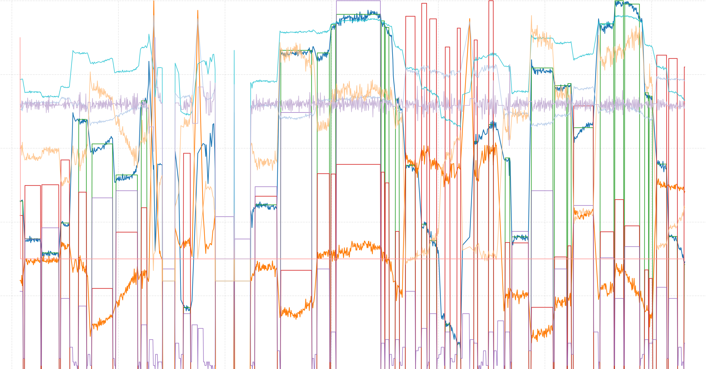
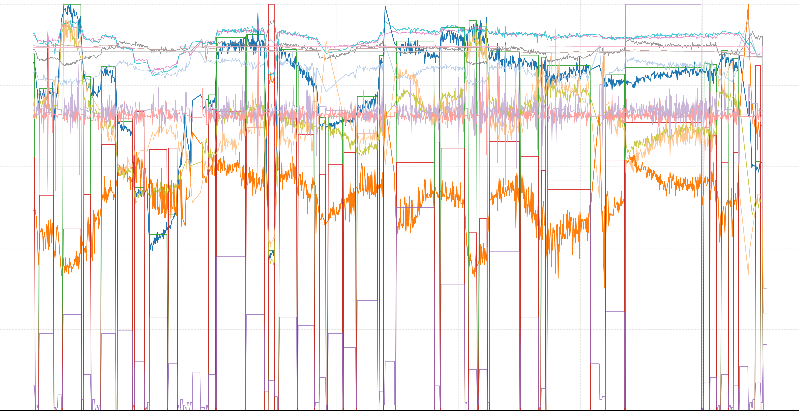
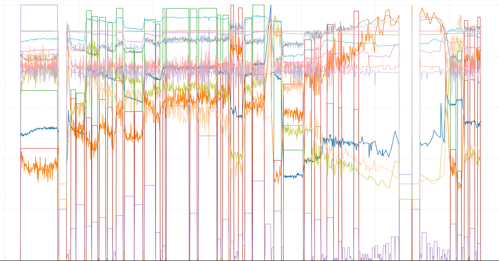
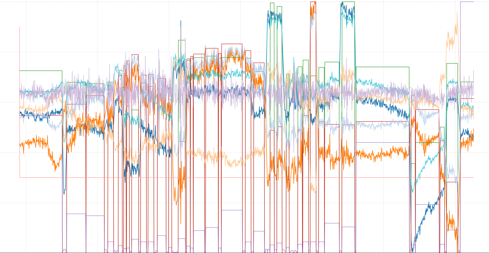
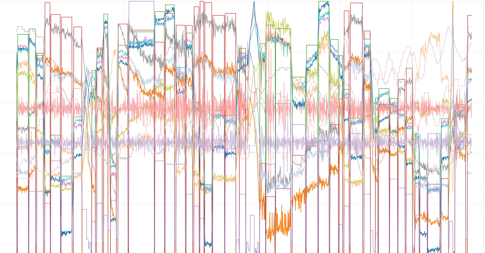
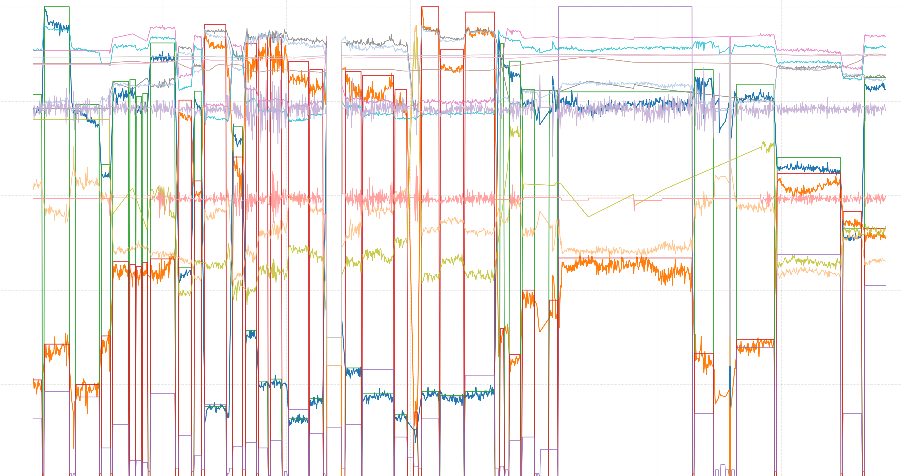
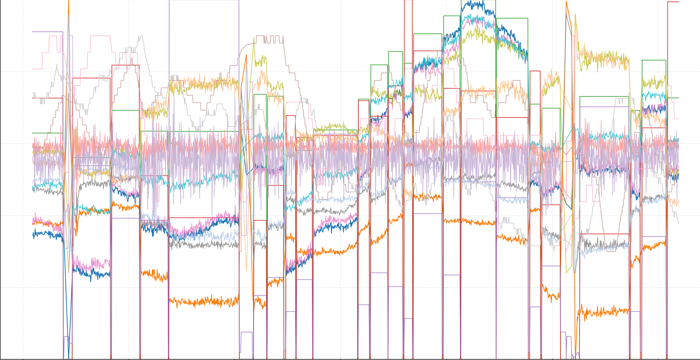

# EMER
## Details
<b>EMER</b> (Eye-behavior-aided Multimodal Emotion Recognition) is an eye-behavior-assisted multimodal affective database dedicated to bridging the "emotion gap" between facial expression recognition (FER) and genuine emotion recognition (ER).  The dataset is collected in controlled lab scenarios by inducing spontaneous emotions in participants via standardized stimulus videos, and features synchronized multimodal data and dual-perspective annotations, providing strong support for robust emotion recognition research.  EMER has the characteristics of complete modalities, high-quality annotations and appropriate scale, including:
- <b>1,303</b> high-quality multimodal samples (from 1623 raw sequences) collected from 121 participants (76 males, 45 females, aged 18-40),
- <b>three core data modalities</b>: facial expression videos (390,900 frames in total), eye movement sequences (1.91 million timestamp samples), and eye fixation heatmaps (7.50GB in size),
- <b>dual-perspective annotation system</b>: ER labels (reflecting genuine emotions) and FER labels (reflecting facial expressions), covering both discrete emotion categories（7-class and 3-class） and continuous valence-arousal scores,
- <b>additional FER annotation dimension</b>: facial expression intensity rating ranging from 0 to 3, obtained via an Active Learning-based Annotation (ALA) method combining model auto-annotation and expert verification.

## Sample
### EMER Dataset Sample Showcase
This table displays multimodal sample information for 7 basic emotions in the EMER dataset, including facial expression video clips, eye movement sequence visualizations, dual labels:

<table id="tfhover" class="tftable" border="1">
  <thead>
    <tr>
      <th>Facial Expression Video</th>
      <th>Eye Movement Sequences</th>
      <th>Label Type</th>
      <th>7-class</th>
      <th>3-class</th>
      <th>Valence</th>
      <th>Arousal</th>
      <th>Intensity</th>
    </tr>
  </thead>
  <tbody>
    <!-- Anger -->
    <tr>
      <td rowspan="2"></td>
      <td rowspan="2"></td>
      <td>ER label</td>
      <td>Anger</td>
      <td>Negative</td>
      <td>-1</td>
      <td>1</td>
      <td>—</td>
    </tr>
    <tr>
      <td>FER label</td>
      <td>Anger</td>
      <td>Negative</td>
      <td>-0.68</td>
      <td>0.72</td>
      <td>1.55</td>
    </tr>
    <!-- 其他行类似 -->
    <!-- Disgust -->
    <tr>
      <td rowspan="2"></td>
      <td rowspan="2"></td>
      <td>ER label</td>
      <td>Disgust</td>
      <td>Negative</td>
      <td>-0.25</td>
      <td>0</td>
      <td>—</td>
    </tr>
    <tr>
      <td>FER label</td>
      <td>Disgust</td>
      <td>Negative</td>
      <td>-0.70</td>
      <td>0</td>
      <td>1.48</td>
    </tr>
    <!-- 其他行类似 -->
    <!-- Fear -->
    <tr>
      <td rowspan="2"></td>
      <td rowspan="2"></td>
      <td>ER label</td>
      <td>Fear</td>
      <td>Negative</td>
      <td>-0.5</td>
      <td>0.5</td>
      <td>—</td>
    </tr>
    <tr>
      <td>FER label</td>
      <td>Neutral</td>
      <td>Negative</td>
      <td>-0.5</td>
      <td>-0.11</td>
      <td>0</td>
    </tr>
    <!-- 其他行类似 -->
    <!-- Happiness -->
    <tr>
      <td rowspan="2"></td>
      <td rowspan="2"></td>
      <td>ER label</td>
      <td>Happiness</td>
      <td>Positive</td>
      <td>0.5</td>
      <td>0.5</td>
      <td>—</td>
    </tr>
    <tr>
      <td>FER label</td>
      <td>Happiness</td>
      <td>Positive</td>
      <td>0.38</td>
      <td>0.17</td>
      <td>2.54</td>
    </tr>
    <!-- 其他行类似 -->
    <!-- Sadness -->
    <tr>
      <td rowspan="2"></td>
      <td rowspan="2"></td>
      <td>ER label</td>
      <td>Sadness</td>
      <td>Negative</td>
      <td>-0.75</td>
      <td>0</td>
      <td>—</td>
    </tr>
    <tr>
      <td>FER label</td>
      <td>Sadness</td>
      <td>Negative</td>
      <td>-0.75</td>
      <td>0</td>
      <td>1.47</td>
    </tr>
    <!-- 其他行类似 -->
    <!-- Surprise -->
    <tr>
      <td rowspan="2"></td>
      <td rowspan="2"></td>
      <td>ER label</td>
      <td>Surprise</td>
      <td>Positive</td>
      <td>0.25</td>
      <td>0.25</td>
      <td>—</td>
    </tr>
    <tr>
      <td>FER label</td>
      <td>Surprise</td>
      <td>Positive</td>
      <td>0.25</td>
      <td>0</td>
      <td>2.58</td>
    </tr>
    <!-- 其他行类似 -->
    <!-- Neutral -->
    <tr>
      <td rowspan="2"></td>
      <td rowspan="2"></td>
      <td>ER label</td>
      <td>Neutral</td>
      <td>Neutral</td>
      <td>0</td>
      <td>0</td>
      <td>—</td>
    </tr>
    <tr>
      <td>FER label</td>
      <td>Neutral</td>
      <td>Positive</td>
      <td>0.09</td>
      <td>-0.04</td>
      <td>0</td>
    </tr>

  </tbody>
</table>

## Terms & Conditions

- EMER database is available for  <b>non-commercial research purposes </b> only.
- You agree  <b>not to </b> reproduce, duplicate, copy, sell, trade, resell or exploit for commercial purposes, any portion of the clips, and any derived data.
- You agree  <b>not to </b> further copy, publish, or distribute any portion of the EMER database. Except for internal use at a single site within the same organization, it is allowed to make copies of the dataset.

## How to get the EMER Dataset

This database is publicly available and free for **professors and research scientists affiliated to a university**.  For students interested in accessing the dataset, please note that the application requires formal endorsement by a faculty member from your institution.

Permission to use (but not reproduce or distribute) the EMER database is granted only if the following steps are properly followed:
1.  Download the [EMER-academics -final.pdf](/academics/emer-academics-final.pdf) document, which serves as the End-User License Agreement (EULA).
2.  Carefully review the terms and conditions to confirm acceptance.  The required information at the end of the document must be completed and signed—**for student applicants, this signature must be from a professor at their affiliated university** to validate the request.
3.  Send the fully completed and signed document to: 1202411179@cug.edu.cn.
<!-- 4.  After review and approval, you will receive download links via email, including two options: **Baidu Netdisk** and **Google Drive**. -->

## Citation
Please cite our paper if you find our work useful for your research:
Kejun Liu, Yuanyuan Liu*, Lin Wei, Z Chen, etc. Smile on the Face, Sadness in the Eyes: Bridging the Emotion Gap with a Multimodal Dataset of Eye and Facial Behaviors. IEEE Transactions on Multimedia, 2025.

## Content Preview

- Data
This section contains folders for storing different types of raw/processed files related to the project:
<image src="imgs/data.png" height="130" />

1. eye_movement data folder: Stores structured numerical data of eye movement metrics (gaze points, pupil diameter, saccades/fixations) with 1.91 million timestamped samples.
2. eye_track video folder: Contains eye movement videos captured by Tobii Pro Fusion eye tracker, visualizing real-time eye behaviors.
3. face video folder: Holds 1,303 preprocessed facial expression videos (1–2 minutes each, 390,900 frames total).
4. face_light_align image folder: Stores standardized facial images with lighting normalization and 3D landmark alignment.

- Labels
This section has files that assign labels (metadata/categorizations) to the data:
<image src="imgs/labels.png" height="130" />

1. EMER_label.xlsx: Excel file with comprehensive emotion labels (3-class/7-class discrete labels, valence/arousal scores, FER intensity scores).
2. emer_set.txt: A text file defining the dataset split.

For more details of the dataset, please refer to the paper: [Smile on the Face, Sadness in the Eyes: Bridging the Emotion Gap with a Multimodal Dataset of Eye and Facial Behaviors](/academics/EMER_final.pdf).

For more details of emotional descriptive texts, please refer to [supplementary materials](/academics/EMER_supp.pdf) for EMER.

##  Code
The source code of our proposed EMERT model can be downloaded in [https://github.com/kejun1/EMER](https://github.com/kejun1/EMER).

## Contact 

Please contact us for any questions about EMER.
<table id="tfhover" class="tftable" border="1">
<tr><td width="20%">Yuanyuan Liu</td><td width="65%">Associate Professor, China University of Geosciences</td><td width="15%"><a href="mailto:liuyy@cug.edu.cn">liuyy@cug.edu.cn</a></td></tr>
<tr><td>Yuanyuan Liu</td><td>Master, China University of Geosciences</td><td><a href="mailto:liukejun@cug.edu.cn">liukejun@cug.edu.cn</a></td></tr>
<tr><td>Ying Qian</td><td>Master, China University of Geosciences</td><td><a href="mailto:1202411179@cug.edu.cn">1202411179@cug.edu.cn</a></td></tr>
</table>

For more information, welcome to visit our team's homepage: [https://cvlab-liuyuanyuan.github.io/](https://cvlab-liuyuanyuan.github.io/)

